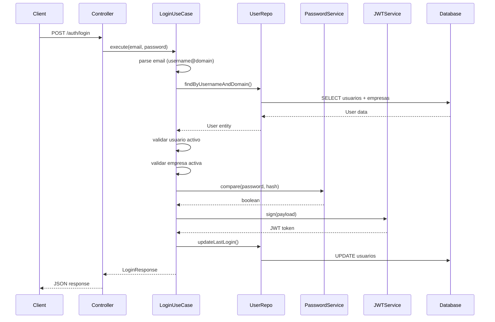

# Módulo de Autenticación - Login

## 🎯 Overview

Sistema de login implementado con Clean Architecture que permite autenticación mediante formato `username@dominioempresa.com`.

## 🔐 Funcionalidad

### Formato de Login
```
username@dominioempresa.com
```

**Ejemplo:** `test_admin@testempresa.com`

### Flujo de Autenticación

1. **Parseo de credenciales:** Extrae username y dominio del email
2. **Búsqueda en BD:** Busca usuario por username + dominio de empresa
3. **Validaciones:** 
   - Usuario activo
   - Empresa activa
   - Password correcto (bcrypt)
4. **Generación JWT:** Token con 15min de expiración
5. **Actualización:** Registra último login del usuario

## 🏗️ Arquitectura

### Domain Layer
```
src/domain/
├── entities/
│   └── User.ts                    # Entidad de usuario
└── repositories/
    └── IUserRepository.ts        # Interfaz de repositorio
```

### Application Layer
```
src/application/use-cases/
└── LoginUseCase.ts               # Lógica de negocio del login
```

### Infrastructure Layer
```
src/infrastructure/
├── repositories/
│   └── PostgresUserRepository.ts # Implementación BD
└── security/
    ├── password.service.ts       # bcrypt
    └── jwt.service.ts            # JWT generation
```

### Presentation Layer
```
src/presentation/
├── controllers/
│   └── auth.controller.ts       # HTTP handler
└── routes/
    └── auth.routes.ts           # Endpoint /auth/login
```

## 🚀 Endpoints

### POST /auth/login

**Request:**
```json
{
  "email": "test_admin@testempresa.com",
  "password": "admin123"
}
```

**Response Exitoso (200):**
```json
{
  "success": true,
  "data": {
    "accessToken": "eyJhbGciOiJIUzI1NiIsInR5cCI6IkpXVCJ9...",
    "user": {
      "id": "usr_1771106679729_d1q8hu8c9",
      "email": "admin2@mail.com",
      "roles": ["admin"],
      "tenant": "testempresa.com"
    }
  }
}
```

**Response Error (401):**
```json
{
  "success": false,
  "message": "Credenciales inválidas"
}
```

**Response Error (400):**
```json
{
  "success": false,
  "message": "Email y password son requeridos"
}
```

## 📊 Base de Datos

### Query Principal
```sql
SELECT u.*, e.dominio, e.activo as empresa_activa
FROM usuarios u
JOIN empresas e ON u.empresa_id = e.id
WHERE u.username = $1 AND e.dominio = $2
LIMIT 1;
```

### Estructura Usuario
```sql
usuarios:
- id (varchar, primary key)
- email (varchar, unique)
- username (varchar, unique por empresa)
- password (varchar, bcrypt hash)
- empresa_id (varchar, foreign key)
- roles (text[], array de roles)
- activo (boolean)
- last_login (timestamp)
- created_at (timestamp)
- updated_at (timestamp)
```

## 🔧 Configuración

### Variables de Entorno
```env
JWT_SECRET=super_secret_key
```

### Dependencias
```json
{
  "bcrypt": "^5.1.1",
  "jsonwebtoken": "^9.0.2",
  "@types/bcrypt": "^5.0.2",
  "@types/jsonwebtoken": "^9.0.6"
}
```

## 🧪 Testing

### Casos de Prueba

**✅ Login Exitoso:**
```bash
curl -X POST http://127.0.0.1:4000/auth/login \
  -H "Content-Type: application/json" \
  -d '{ "email": "test_admin@testempresa.com", "password": "admin123" }'
```

**❌ Credenciales Inválidas:**
```bash
curl -X POST http://127.0.0.1:4000/auth/login \
  -H "Content-Type: application/json" \
  -d '{ "email": "usuario@dominio.com", "password": "wrong" }'
```

**❌ Formato Inválido:**
```bash
curl -X POST http://127.0.0.1:4000/auth/login \
  -H "Content-Type: application/json" \
  -d '{ "email": "formato_invalido", "password": "admin123" }'
```

## 🔒 Seguridad

### Password Hashing
- **Algoritmo:** bcrypt
- **Salt:** Generado automáticamente
- **Cost Factor:** 12 (por defecto)

### JWT Configuration
- **Algoritmo:** HS256
- **Expiración:** 15 minutos
- **Payload:** userId, empresaId, roles

### Validaciones
- **Formato email:** username@domain.com
- **Usuario activo:** Verificación campo `activo`
- **Empresa activa:** Verificación campo `empresa_activa`
- **Password:** Comparación segura con bcrypt

## 🔄 Flujo Completo



## 📋 Próximos Pasos

### Mejoras Planeadas
- [ ] Refresh token (RT)
- [ ] Multiple sessions
- [ ] Rate limiting
- [ ] Login attempts tracking
- [ ] Password recovery
- [ ] Two-factor authentication

### Middleware de Autorización
- [ ] JWT verification middleware
- [ ] Role-based access control (RBAC)
- [ ] Tenant isolation
- [ ] Protected routes

## 🚨 Errores Comunes

### Credenciales Inválidas
- **Causa:** Username no existe o password incorrecto
- **Solución:** Verificar credenciales en BD

### Usuario Inactivo
- **Causa:** Campo `activo` = false
- **Solución:** Activar usuario desde administración

### Empresa Inactiva
- **Causa:** Campo `activo` = false en tabla empresas
- **Solución:** Activar empresa desde administración

### Formato Inválido
- **Causa:** Email no contiene @ o formato incorrecto
- **Solución:** Usar formato username@dominio.com

---

**Módulo de login funcional y listo para producción.**
