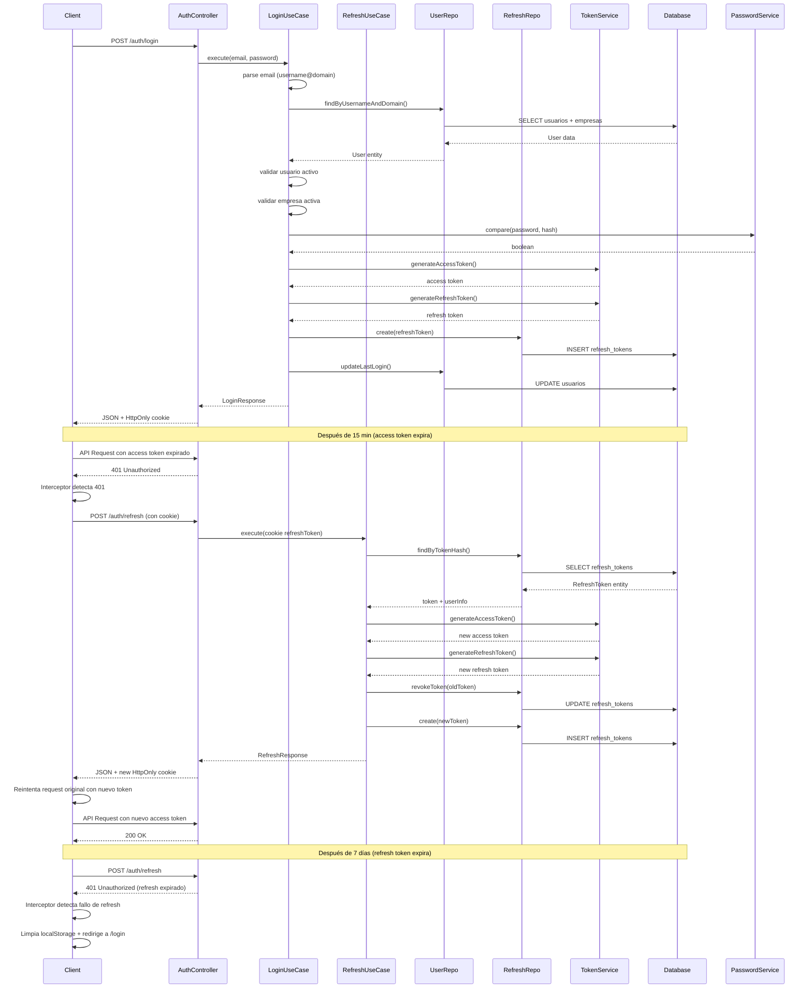

# Módulo de Autenticación - Login

## 🎯 Overview

Sistema de autenticación enterprise-ready implementado con Clean Architecture que permite autenticación mediante formato `username@dominioempresa.com` con refresh tokens para sesiones persistentes.

## 🔐 Funcionalidad

### Formato de Login
```
username@dominioempresa.com
```

**Ejemplo:** `test_admin@testempresa.com`

### Flujo de Autenticación Completo

1. **Parseo de credenciales:** Extrae username y dominio del email
2. **Búsqueda en BD:** Busca usuario por username + dominio de empresa
3. **Validaciones:** 
   - Usuario activo
   - Empresa activa
   - Password correcto (bcrypt)
4. **Generación Token Pair:** Access token (15min) + Refresh token (7 días)
5. **Almacenamiento:** Refresh token en BD con HttpOnly cookie
6. **Actualización:** Registra último login del usuario

### Refresh Token Flow

1. **Request:** Cliente envía refresh token (cookie HttpOnly o body)
2. **Validación:** Verifica token no expirado ni revocado
3. **Rotación:** Genera nuevo refresh token, revoca anterior
4. **Generación:** Nuevo access token con user info del refresh token
5. **Response:** Nuevo access token + refresh token en cookie + localStorage

### Frontend Refresh Automático

1. **Interceptor 401:** Detecta access token expirado
2. **Control Concurrente:** Evita múltiples refresh simultáneos
3. **Cookie Management:** Usa HttpOnly cookies + localStorage fallback
4. **Queue Processing:** Reintenta peticiones pendientes
5. **Session Cleanup:** Logout automático si refresh falla

### Logout Flow

1. **Request:** Cliente envía refresh token
2. **Revocación:** Marca refresh token como revocado
3. **Cleanup:** Limpia HttpOnly cookie
4. **Response:** Confirmación de logout

## 🏗️ Arquitectura

### Domain Layer
```
src/domain/
├── entities/
│   ├── User.ts                    # Entidad de usuario
│   └── RefreshToken.ts           # Entidad de refresh token
└── repositories/
    ├── IUserRepository.ts        # Interfaz de repositorio usuario
    └── IRefreshTokenRepository.ts # Interfaz de repositorio refresh token
```

### Application Layer
```
src/application/use-cases/
├── LoginUseCase.ts               # Lógica de negocio del login
├── RefreshUseCase.ts            # Lógica de refresh token
└── LogoutUseCase.ts             # Lógica de logout
```

### Infrastructure Layer
```
src/infrastructure/
├── repositories/
│   ├── PostgresUserRepository.ts         # Implementación BD usuario
│   └── PostgresRefreshTokenRepository.ts  # Implementación BD refresh token
└── security/
    ├── password.service.ts              # bcrypt
    ├── token.service.ts                 # Access/Refresh tokens
    └── crypto.service.ts                 # Utilidades criptográficas
```

### Presentation Layer
```
src/presentation/
├── controllers/
│   ├── auth.controller.ts        # HTTP handler login
│   ├── refresh.controller.ts     # HTTP handler refresh
│   └── logout.controller.ts      # HTTP handler logout
└── routes/
    ├── auth.routes.ts            # Endpoint /auth/login
    ├── refresh.routes.ts         # Endpoint /auth/refresh
    └── logout.routes.ts          # Endpoint /auth/logout
```

## 🚀 Endpoints

### POST /auth/login

**Request:**
```json
{
  "email": "test_admin@testempresa.com",
  "password": "admin123"
}
```

**Response Exitoso (200):**
```json
{
  "success": true,
  "data": {
    "accessToken": "eyJhbGciOiJIUzI1NiIsInR5cCI6IkpXVCJ9...",
    "refreshToken": "8e5a140f1460f11b81a96ad569971bc1c7be52fe...",
    "expiresIn": 900,
    "user": {
      "id": "usr_1771106679729_d1q8hu8c9",
      "email": "admin2@mail.com",
      "roles": ["admin"],
      "tenant": "testempresa.com"
    }
  }
}
```

**Headers:**
```
Set-Cookie: refreshToken=8e5a140f1460f11b81a96ad569971bc1c7be52fe...; HttpOnly; Secure; SameSite=Strict; Path=/; Max-Age=604800000
```

### POST /auth/refresh

**Request (Cookie - Prioridad):**
```json
{}
```
*Con HttpOnly cookie automáticamente enviada*

**Request (Body - Fallback):**
```json
{
  "refreshToken": "8e5a140f1460f11b81a96ad569971bc1c7be52fe..."
}
```

**Response Exitoso (200):**
```json
{
  "success": true,
  "data": {
    "accessToken": "eyJhbGciOiJIUzI1NiIsInR5cCI6IkpXVCJ9...",
    "refreshToken": "91a0d65112f2a069e1d390e9c7417e53b227d9e4...",
    "expiresIn": 900,
    "user": {
      "id": "usr_1771106679729_d1q8hu8c9",
      "email": "admin2@mail.com",
      "roles": ["admin"],
      "tenant": "testempresa.com"
    }
  }
}
```

### POST /auth/logout

**Request:**
```json
{
  "refreshToken": "8e5a140f1460f11b81a96ad569971bc1c7be52fe..."
}
```

**Response Exitoso (200):**
```json
{
  "success": true,
  "message": "Sesión cerrada exitosamente"
}
```

**Headers:**
```
Set-Cookie: refreshToken=; HttpOnly; Secure; SameSite=Strict; Path=/; Expires=Thu, 01 Jan 1970 00:00:00 GMT
```

## 📊 Base de Datos

### Tabla refresh_tokens
```sql
CREATE TABLE refresh_tokens (
    id UUID PRIMARY KEY DEFAULT gen_random_uuid(),
    user_id VARCHAR(255) NOT NULL,
    token_hash VARCHAR(255) NOT NULL UNIQUE,
    expires_at TIMESTAMP WITH TIME ZONE NOT NULL,
    created_at TIMESTAMP WITH TIME ZONE DEFAULT NOW(),
    revoked_at TIMESTAMP WITH TIME ZONE NULL,
    last_used_at TIMESTAMP WITH TIME ZONE NULL,
    ip_address INET,
    user_agent TEXT,
    is_active BOOLEAN DEFAULT true,
    user_info JSONB,
    CONSTRAINT fk_refresh_tokens_user_id FOREIGN KEY (user_id) REFERENCES usuarios(id) ON DELETE CASCADE
);
```

### Query Principal
```sql
SELECT u.*, e.dominio, e.activo as empresa_activa
FROM usuarios u
JOIN empresas e ON u.empresa_id = e.id
WHERE u.username = $1 AND e.dominio = $2
LIMIT 1;
```

### Estructura Usuario
```sql
usuarios:
- id (varchar, primary key)
- email (varchar, unique)
- username (varchar, unique por empresa)
- password (varchar, bcrypt hash)
- empresa_id (varchar, foreign key)
- roles (text[], array de roles)
- activo (boolean)
- last_login (timestamp)
- created_at (timestamp)
- updated_at (timestamp)
```

## 🔧 Configuración

### Variables de Entorno
```env
JWT_SECRET=super_secret_key
REFRESH_TOKEN_SECRET=super_refresh_secret
REFRESH_TOKEN_DAYS=7
```

### Dependencias
```json
{
  "bcrypt": "^5.1.1",
  "jsonwebtoken": "^9.0.2",
  "cookie-parser": "^1.4.6",
  "uuid": "^9.0.1",
  "@types/bcrypt": "^5.0.2",
  "@types/jsonwebtoken": "^9.0.6",
  "@types/cookie-parser": "^1.4.7",
  "@types/uuid": "^9.0.8"
}
```

## 🧪 Testing

### Casos de Prueba

**✅ Login Exitoso:**
```bash
curl -X POST http://127.0.0.1:4000/auth/login \
  -H "Content-Type: application/json" \
  -d '{ "email": "test_admin@testempresa.com", "password": "admin123" }' \
  -c cookies.txt
```

**✅ Refresh Token Exitoso:**
```bash
curl -X POST http://127.0.0.1:4000/auth/refresh \
  -H "Content-Type: application/json" \
  -d '{ "refreshToken": "8e5a140f1460f11b81a96ad569971bc1c7be52fe..." }' \
  -b cookies.txt
```

**✅ Logout Exitoso:**
```bash
curl -X POST http://127.0.0.1:4000/auth/logout \
  -H "Content-Type: application/json" \
  -d '{ "refreshToken": "8e5a140f1460f11b81a96ad569971bc1c7be52fe..." }' \
  -b cookies.txt
```

**❌ Credenciales Inválidas:**
```bash
curl -X POST http://127.0.0.1:4000/auth/login \
  -H "Content-Type: application/json" \
  -d '{ "email": "usuario@dominio.com", "password": "wrong" }'
```

**❌ Refresh Token Inválido:**
```bash
curl -X POST http://127.0.0.1:4000/auth/refresh \
  -H "Content-Type: application/json" \
  -d '{ "refreshToken": "token_invalido" }'
```

## 🔒 Seguridad

### Password Hashing
- **Algoritmo:** bcrypt
- **Salt:** Generado automáticamente
- **Cost Factor:** 12 (por defecto)

### Token Configuration
- **Access Token:** HS256, 15 minutos
- **Refresh Token:** SHA-256 hash, 7 días
- **Token Rotation:** Nuevo refresh token cada uso
- **HttpOnly Cookies:** Protección contra XSS

### Seguridad de Refresh Tokens
- **Hashing:** SHA-256 del token original
- **Rotation:** Nuevo token generado cada refresh
- **Revocación:** Tokens marcados como inactivos
- **Cleanup:** Limpieza automática de tokens expirados
- **User Info:** Información del usuario almacenada en BD

### Validaciones
- **Formato email:** username@domain.com
- **Usuario activo:** Verificación campo `activo`
- **Empresa activa:** Verificación campo `empresa_activa`
- **Password:** Comparación segura con bcrypt
- **Token Expiración:** Verificación de fechas
- **Token Revocación:** Verificación de estado activo

## 🔄 Flujo Completo con Refresh Automático



## 📋 Características Implementadas

### ✅ Completas
- [x] Login con formato username@domain.com
- [x] Access token con 15min de expiración
- [x] Refresh token con 7 días de vida
- [x] Token rotation automático
- [x] HttpOnly cookies para refresh tokens
- [x] Logout con revocación completa
- [x] Multi-sesión soportada
- [x] Cleanup automático de tokens expirados
- [x] Validaciones de usuario y empresa activa
- [x] Seguridad enterprise-grade (XSS, CSRF protection)
- [x] **Refresh automático en frontend** (interceptor avanzado)
- [x] **Control concurrente de refresh** (evita loops infinitos)
- [x] **Cookie + localStorage dual storage** (máxima compatibilidad)
- [x] **Circular import elimination** (arquitectura limpia)
- [x] **Session hydration automática** (restauración transparente)

### 🔧 Middleware de Autorización
- [ ] JWT verification middleware
- [ ] Role-based access control (RBAC)
- [ ] Tenant isolation
- [ ] Protected routes

## 🚨 Errores Comunes y Soluciones

### Credenciales Inválidas
- **Causa:** Username no existe o password incorrecto
- **Solución:** Verificar credenciales en BD

### Refresh Token Inválido
- **Causa:** Token no encontrado, expirado o revocado
- **Solución:** Realizar nuevo login

### Loop Infinito de Refresh
- **Causa:** Múltiples peticiones 401 sin control concurrente
- **Solución:** Implementar flag isRefreshing + cola de peticiones

### Circular Import en Desarrollo
- **Causa:** axiosInstance importa getAccessToken de AuthContext
- **Solución:** Usar localStorage directamente en interceptor

### Session no Persiste
- **Causa:** Tokens no sincronizados con localStorage
- **Solución:** Guardar tokens en localStorage + session hydration

### Usuario Inactivo
- **Causa:** Campo `activo` = false
- **Solución:** Activar usuario desde administración

### Empresa Inactiva
- **Causa:** Campo `activo` = false en tabla empresas
- **Solución:** Activar empresa desde administración

### Formato Inválido
- **Causa:** Email no contiene @ o formato incorrecto
- **Solución:** Usar formato username@dominio.com

### Token Rotation Error
- **Causa:** Error en generación de nuevo refresh token
- **Solución:** Verificar configuración de crypto service

---

**Módulo de autenticación enterprise-ready con refresh tokens implementado y listo para producción.**
