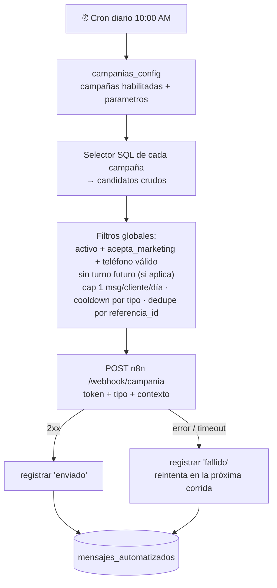
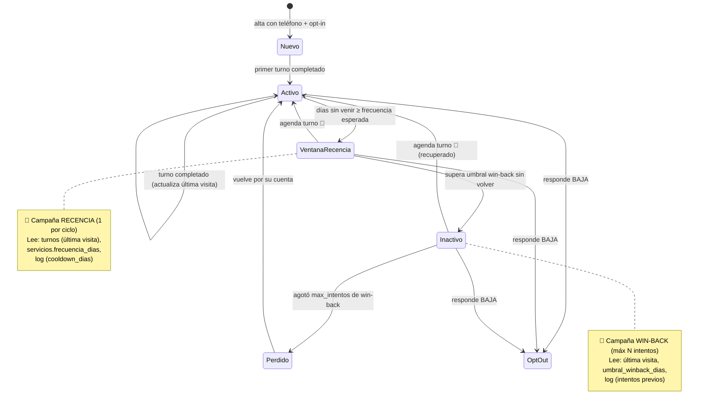
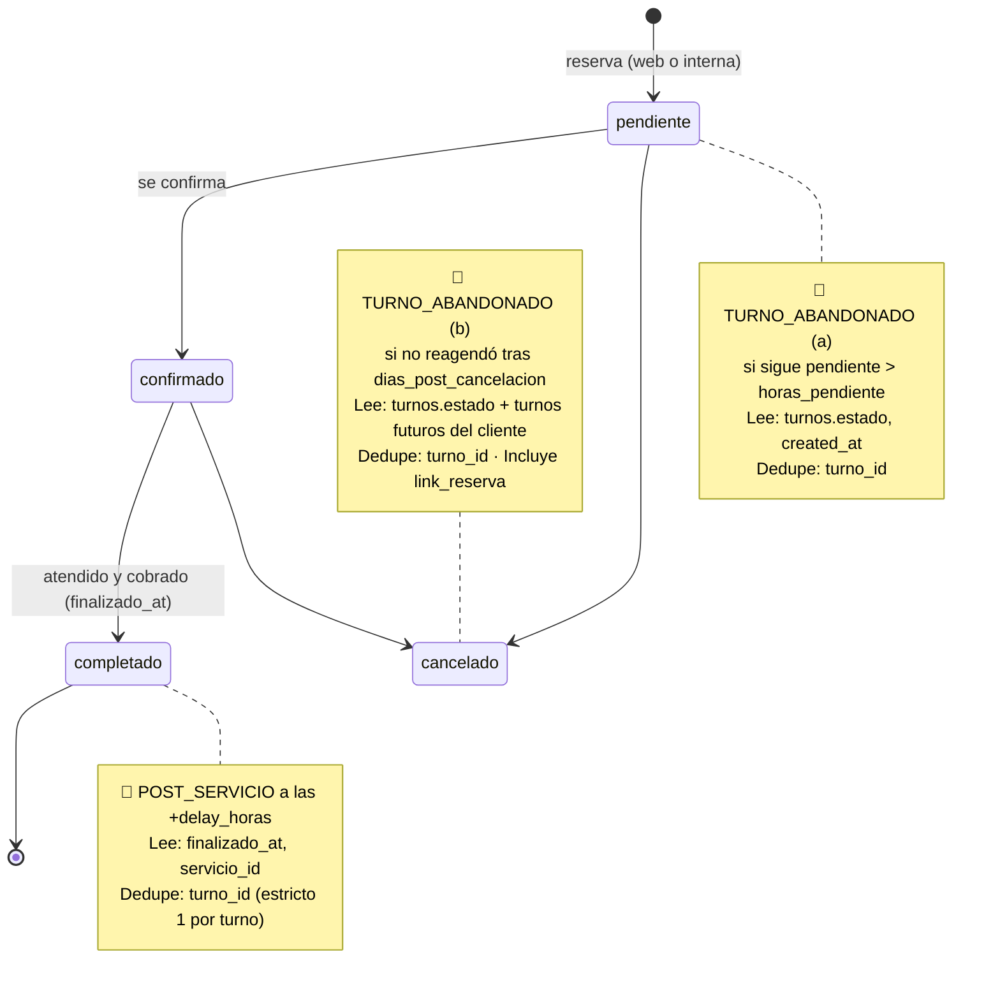
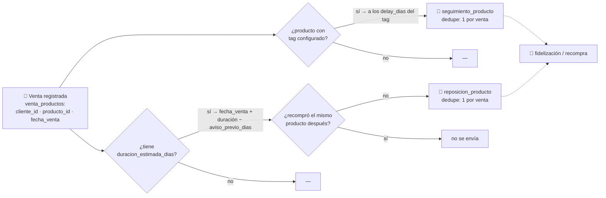
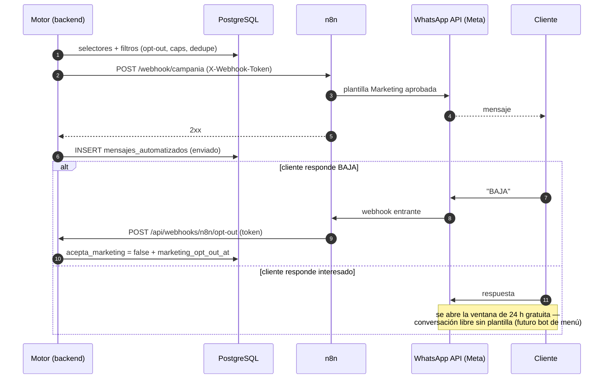
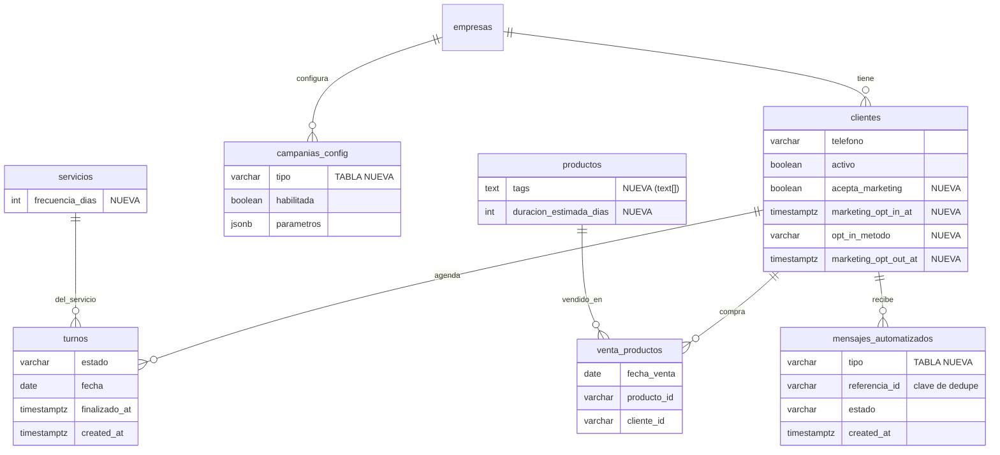
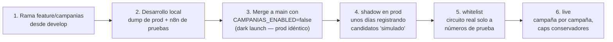

# Bot de WhatsApp — Extensión a campañas automatizadas

> **Estado:** investigación / diseño (no implementado)
> **Fecha:** 2026-07-09
> **Alcance:** recordatorio por recencia, win-back, post-servicio, seguimiento de producto por tags, reposición de producto, turno abandonado.
> **Nota de presupuesto:** el costo de la API de WhatsApp (Meta) queda **fuera** de este presupuesto; acá solo se presupuesta desarrollo (backend, frontend, n8n).
> **Contexto single-tenant:** aunque el código es multi-tenant (`empresa_id` en todas las tablas), este deploy está dedicado a **una sola empresa** y esta versión no se usará para otras (un eventual SaaS iría en otro host). Las tablas nuevas mantienen `empresa_id` por consistencia con el esquema, pero el diseño no invierte esfuerzo en configurabilidad ni aislamiento por tenant.

---

## 1. Qué tenemos hoy (estado actual verificado en el código)

### 1.1 Integración WhatsApp vía n8n

El backend **no habla con la WhatsApp API directamente**: hace `POST` fire-and-forget a webhooks de n8n y n8n orquesta el envío real. Todo vive en `backend/src/infrastructure/services/n8n.service.ts`.

| Webhook n8n                    | Cuándo se dispara                  | Payload                                                                 |
| ------------------------------ | ---------------------------------- | ----------------------------------------------------------------------- |
| `/webhook/crear-turno`         | Al crear turno (interno y público) | appointment_id, customer_name/email/phone, service, professional, fecha |
| `/webhook/enviar-recordatorio` | Cron diario 8:00 AM                | turno_id, customer_name/phone, service_name, professional_name, hora    |
| `/webhook/cancelar-turno`      | Cancelación desde la web pública   | turno + teléfono del profesional                                        |

Características actuales relevantes para el diseño:

- **Config:** una sola variable de entorno, `N8N_WEBHOOK_BASE_URL` (leída directo de `process.env`, no está en `config/env.ts`).
- **Timeout 10 s** con `AbortController`; nunca propaga excepciones.
- **Teléfonos** normalizados a formato argentino `54...` con `N8nService.normalizarTelefono()`.
- ⚠️ **Los payloads NO incluyen `empresa_id`** — n8n hoy no sabe de qué tenant es el mensaje.
- ⚠️ **Los webhooks no tienen autenticación** (ni token ni HMAC).
- **Registro de envíos:** solo 3 flags booleanos en `turnos` (`confirmacion_whatsapp_enviada`, `confirmacion_email_enviada` —nunca se escribe—, `recordatorio_enviado`). **No existe tabla de log de mensajes.**
- **No existe configuración por empresa** (la tabla `empresas` solo tiene `plan`, `activo`, `dominio`).

### 1.2 Infraestructura de jobs

- Única librería: **node-cron**, in-process dentro del mismo proceso Express (Railway, 1 réplica).
- **Un solo cron activo:** recordatorios diarios a las 8:00 (`backend/src/infrastructure/cron/recordatorio.cron.ts`), timezone `America/Argentina/Buenos_Aires`, registrado en `server.ts`.
- La query del cron es **global** (todas las empresas en una pasada, sin filtro `empresa_id`).
- Sin colas, sin workers, sin reintentos inmediatos (un fallo se reintenta recién en la corrida del día siguiente porque el flag no se marca).
- ⚠️ **Hallazgo:** `CompletarTurnosVencidosUseCase` (marca `completado` a turnos confirmados ya pasados) existe y tiene tests, **pero no está registrado en ningún cron ni endpoint: hoy no corre nunca**. Además, si se activara tal cual, completa turnos sin crear `comisiones_turno` ni setear `finalizado_at` (quedarían invisibles en finanzas). Esto afecta directamente a la campaña post-servicio (ver §3.3).

### 1.3 Modelo de datos — qué sirve y qué falta

**Datos que YA existen y alcanzan para seleccionar clientes:**

- `clientes`: `telefono`, `activo`, `empresa_id`, `created_at`. Email opcional desde migración 009.
- `turnos`: `fecha`, `hora`, `estado` (CHECK: `pendiente` | `confirmado` | `cancelado` | `completado`), `servicio_id`, `total_final`, `finalizado_at` (fecha de cobro), `origen` (`web`/`interno`). La "última visita" de un cliente es **computable** (último turno completado) — hoy se calcula al vuelo en `GetClientePerfilUseCase`.
- `venta_productos`: `cliente_id`, `producto_id`, `fecha_venta` (migración 007), `venta_grupo_id` — sabemos **qué cliente compró qué producto y cuándo**.
- `productos`: `stock`, `marca_id`, precios.
- `servicios`: `categoria`, `duracion`, precios.

**Datos que NO existen (hay que agregar):**

| Faltante                                            | Necesario para                              |
| --------------------------------------------------- | ------------------------------------------- |
| Consentimiento / opt-out de marketing en `clientes` | Todas las campañas (política de Meta + ley) |
| Tags en `productos`                                 | Seguimiento de producto                     |
| Duración estimada de uso en `productos`             | Reposición de producto                      |
| Frecuencia recomendada en `servicios`               | Recencia / win-back                         |
| Log de mensajes automatizados                       | Idempotencia, anti-spam, métricas — todas   |
| Config de campañas por empresa                      | Todas                                       |
| Concepto de "reserva iniciada no terminada"         | Turno abandonado (variante carrito)         |

> Nota: existe una tabla legacy `cliente_profesional` con campos tipo `ultima_visita`, `frecuencia_visita`, `servicios_preferidos`, `recordatorios_habilitados`, pero **no la usa ningún código del backend**. Sirve como referencia de diseño, no conviene reactivarla: la última visita se computa desde `turnos` y no puede desincronizarse.

---

## 2. Infraestructura común nueva (Fase 0 — bloqueante para todas las campañas)

Antes de cualquier campaña hay que construir una base compartida. Es el grueso del trabajo.

### 2.1 Migraciones de base de datos

```sql
-- Configuración de campañas por empresa (una fila por tipo)
CREATE TABLE campanias_config (
  id           varchar(255) PRIMARY KEY,
  empresa_id   varchar(255) NOT NULL REFERENCES empresas(id),
  tipo         varchar(30)  NOT NULL,  -- 'recencia' | 'winback' | 'post_servicio'
                                       -- | 'seguimiento_producto' | 'reposicion_producto'
                                       -- | 'turno_abandonado'
  habilitada   boolean      NOT NULL DEFAULT false,
  parametros   jsonb        NOT NULL DEFAULT '{}',  -- umbrales, delays, ventana horaria
  created_at   timestamptz  DEFAULT now(),
  updated_at   timestamptz  DEFAULT now(),
  UNIQUE (empresa_id, tipo)
);

-- Log de todo mensaje automatizado enviado (idempotencia + anti-spam + métricas)
CREATE TABLE mensajes_automatizados (
  id            varchar(255) PRIMARY KEY,
  empresa_id    varchar(255) NOT NULL,
  cliente_id    varchar(255) NOT NULL,
  tipo          varchar(30)  NOT NULL,
  referencia_id varchar(255),          -- turno_id / venta_id según campaña (clave de dedupe)
  estado        varchar(15)  NOT NULL, -- 'enviado' | 'fallido' | 'simulado' (modo shadow, §9.2)
  telefono      varchar(20),
  detalle       jsonb,                 -- snapshot del payload / error
  created_at    timestamptz  DEFAULT now()
);
CREATE INDEX idx_mensajes_auto_dedupe
  ON mensajes_automatizados (empresa_id, cliente_id, tipo, created_at);
CREATE INDEX idx_mensajes_auto_ref
  ON mensajes_automatizados (tipo, referencia_id);

-- Opt-in / opt-out de marketing (los transaccionales — confirmación/recordatorio — NO se ven afectados)
ALTER TABLE clientes  ADD COLUMN acepta_marketing boolean NOT NULL DEFAULT true;
ALTER TABLE clientes  ADD COLUMN marketing_opt_in_at timestamptz;  -- cuándo dio consentimiento (evidencia ante Meta)
ALTER TABLE clientes  ADD COLUMN opt_in_metodo varchar(30);        -- 'checkbox_reserva' | 'alta_dashboard'
                                                                   -- | 'respuesta_whatsapp' | 'base_existente'
ALTER TABLE clientes  ADD COLUMN marketing_opt_out_at timestamptz;

-- Parámetros por servicio y producto
ALTER TABLE servicios ADD COLUMN frecuencia_dias int;            -- NULL = sin recencia
ALTER TABLE productos ADD COLUMN tags text[] NOT NULL DEFAULT '{}';
ALTER TABLE productos ADD COLUMN duracion_estimada_dias int;     -- NULL = sin reposición
```

### 2.2 Motor de campañas (nuevo cron orquestador)

Un cron nuevo (`campanias.cron.ts`), separado del de recordatorios, corriendo por ejemplo a las 10:00 AM AR (dentro de la ventana horaria razonable para marketing):

```
para cada empresa activa:
  para cada campaña habilitada en campanias_config:
    candidatos = selector SQL de la campaña (ver §3)
    filtrar:  - cliente.activo && cliente.acepta_marketing && telefono no vacío
              - sin turno futuro confirmado/pendiente (para recencia/winback/abandonado)
              - cap global: máx 1 mensaje automatizado por cliente por día
              - cooldown por tipo: no repetir mismo tipo al mismo cliente en N días
              - dedupe por referencia: no repetir (tipo, referencia_id)
    para cada candidato:
      POST n8n /webhook/campania  (payload genérico, ver §2.3)
      registrar en mensajes_automatizados (enviado/fallido)
```

Decisiones de diseño del motor:

- **`empresa_id` por consistencia, sin sobre-ingeniería multi-tenant**: este deploy sirve a una sola empresa, así que el motor no necesita iterar tenants ni manejar ventanas horarias por empresa — la configuración es efectivamente única (una fila por campaña en `campanias_config`).
- **Idempotente**: el log `mensajes_automatizados` es la fuente de verdad; si el proceso se cae a mitad, la próxima corrida no re-envía lo ya registrado.
- **Serializado con pausa entre envíos** (igual que el cron actual) para no saturar n8n/Meta.
- **Dry-run**: endpoint interno (super admin) que devuelve los candidatos del día sin enviar — imprescindible para probar en prod sin spamear.
- Restricción heredada: node-cron in-process ⇒ **mantener 1 réplica en Railway** (si se escala, los envíos se duplican). Documentado como riesgo aceptado; migrar a job dedicado queda fuera de alcance.

### 2.3 Contrato con n8n — un webhook genérico

Un solo endpoint nuevo del lado n8n (`/webhook/campania`) con `switch` por tipo, en vez de 6 webhooks. Payload propuesto:

```jsonc
{
  "tipo": "winback",                    // discrimina la plantilla en n8n
  "empresa_id": "...",                  // NUEVO — hoy ningún payload lo lleva
  "empresa_nombre": "Estética X",       // para armar el mensaje
  "cliente_id": "...",
  "customer_name": "Juan",
  "customer_phone": "54911...",         // ya normalizado
  "contexto": {                         // campos específicos por tipo
    "servicio_habitual": "Corte",       // recencia / winback
    "dias_desde_ultima_visita": 45,
    "producto": "Shampoo X",            // seguimiento / reposición
    "fecha_compra": "2026-06-01",
    "turno_fecha": "2026-07-08",        // post_servicio / abandonado
    "link_reserva": "https://.../reservar"
  }
}
```

Además:

- **Autenticación del webhook**: header `X-Webhook-Token` con secret compartido (env nueva `N8N_WEBHOOK_TOKEN`), agregado también a los 3 webhooks existentes. Hoy van sin auth.
- **Canal de vuelta n8n → backend**: endpoint `POST /api/webhooks/n8n/opt-out` (protegido por el mismo token) para que n8n marque `acepta_marketing = false` cuando el cliente responde "BAJA"/"STOP". Obligatorio por política de Meta.
- Mover `N8N_WEBHOOK_BASE_URL` a `config/env.ts` junto con el token nuevo.

### 2.4 Reglas de WhatsApp/Meta que condicionan el diseño (sin impacto en este presupuesto, pero sí en el trabajo de n8n)

- Los mensajes fuera de la ventana de 24 h (todos estos casos) **requieren plantillas aprobadas por Meta**, categoría *Marketing* (el recordatorio actual es *Utility*). Hay que redactar y someter a aprobación ~6 plantillas.
- Meta exige **opt-in** del cliente y penaliza el spam bajando el *quality rating* del número (puede terminar en bloqueo). De ahí los caps y cooldowns del motor — no son opcionales.
- El opt-out por respuesta debe funcionar antes de encender cualquier campaña.

### 2.5 Opt-in y opt-out — implementación y cómo lo controla Meta

**Meta no verifica el opt-in por adelantado**: no hay dónde subir comprobantes ni control al aprobar plantillas. La exigencia es de política (Business Messaging Policy) y el control real es **reactivo, por comportamiento de los usuarios**: cada bloqueo/reporte baja el *quality rating* del número (visible en WhatsApp Manager); si cae, Meta reduce límites de envío, pausa plantillas y en el extremo restringe el número. Recién en una apelación puede pedir **evidencia del consentimiento** — para eso se guardan `marketing_opt_in_at` + `opt_in_metodo` (§2.1).

Implementación en tres piezas:

1. **Captura para clientes nuevos:** checkbox *"Acepto recibir recordatorios y novedades por WhatsApp"* en el formulario de reserva pública y en el alta/edición de cliente del dashboard. Setea `acepta_marketing` y registra timestamp + método. Los mensajes **transaccionales** (confirmación/recordatorio del turno que el cliente sacó) no requieren este consentimiento — el checkbox es para marketing.

2. **Base existente (decisión de negocio, con el cliente):**
   
   - **(a) Default `true` + baja fácil** — lo que hace la mayoría de los negocios chicos; riesgo real mínimo con volúmenes bajos (`opt_in_metodo = 'base_existente'`).
   - **(b) Punto medio** — el primer mensaje de campaña incluye bien visible *"respondé BAJA para no recibir más"*: opt-in tácito con salida inmediata.
   - **(c) Estricta** — plantilla inicial "¿Querés recibir avisos? Respondé SÍ" y solo quien responde queda habilitado. Máxima protección pero mata el alcance (poca gente responde).
   - Recomendación: (a) o (b).

3. **Opt-out operativo (innegociable, protege el rating):** si darse de baja es fácil, la gente se da de baja en vez de bloquear — y el bloqueo es lo único que Meta castiga. Toda plantilla de marketing termina con la instrucción de baja; n8n detecta "BAJA"/"STOP" y llama al endpoint del backend (§2.3) que marca `acepta_marketing = false`. Debe funcionar **antes** de encender la primera campaña.

---

## 3. Diseño por campaña

Convención: cada campaña define **(a)** selector SQL, **(b)** parámetros configurables (`campanias_config.parametros`), **(c)** clave de dedupe en el log.

### 3.1 Recordatorio por recencia

**Objetivo:** "ya te toca" — el cliente está llegando al final de su ciclo habitual entre visitas.

- **Selector:** por cliente, último turno `completado`; servicio habitual = el más frecuente entre sus turnos completados (últimos 12 meses). Intervalo esperado = `servicios.frecuencia_dias` del servicio habitual; *fallback* = mediana de los intervalos entre visitas del propio cliente (mínimo 3 visitas para calcularla). Candidato si `hoy - ultima_visita` está entre `frecuencia` y `frecuencia + ventana_dias`.
- **Exclusiones:** turno futuro ya agendado; mensaje de recencia o winback en los últimos `cooldown_dias`.
- **Parámetros:** `ventana_dias` (default 14), `cooldown_dias` (default 30).
- **Dedupe:** `referencia_id = cliente_id + mes` (máx 1 por ciclo).
- **Dependencias:** columna `servicios.frecuencia_dias` + UI para cargarla.

### 3.2 Win-back (cliente perdido)

**Objetivo:** recuperar clientes que superaron largamente su ciclo. Es la **etapa 2 del mismo eje que recencia** — comparten el cálculo de última visita y frecuencia, cambia el umbral. Excluyentes entre sí.

- **Selector:** `hoy - ultima_visita >= max(umbral_winback_dias, 2 × frecuencia_esperada)`.
- **Escalera:** máx `max_intentos` mensajes (default 2, separados por `cooldown_dias`); si no vuelve, se deja de contactar (queda registrado en el log — el selector excluye a quien ya agotó intentos).
- **Parámetros:** `umbral_winback_dias` (default 60), `max_intentos` (2), `cooldown_dias` (30), `incentivo` (texto libre opcional para la plantilla, ej. descuento).
- **Dedupe:** `cliente_id + nro_intento`.
- **Dependencias:** las mismas de recencia.

### 3.3 Post-servicio

**Objetivo:** mensaje 24–48 h después del servicio (agradecimiento, cómo resultó, pedir reseña de Google, tips de cuidado).

- **Selector:** turnos con `finalizado_at` entre `hoy - delay_horas - margen` y `hoy - delay_horas`, sin mensaje post-servicio para ese turno.
- **Parámetros:** `delay_horas` (default 24), opcional `solo_servicios: [ids]` o `solo_categorias`.
- **Dedupe:** `referencia_id = turno_id` (estrictamente 1 por turno).
- ⚠️ **Dependencia crítica:** basarse en `finalizado_at` (turno cobrado) es lo confiable hoy. Si el cliente quiere cubrir también turnos que nunca se cobran en el sistema, hay que **activar el cron huérfano de turnos vencidos** — y antes arreglar que complete turnos sin `finalizado_at` ni comisiones (bug conocido que los deja fuera de finanzas). Recomendación: v1 solo con `finalizado_at`; activar el cron de vencidos es una tarea separada con impacto en finanzas.

### 3.4 Seguimiento de producto (por tags)

**Objetivo:** X días después de comprar un producto con determinado tag, mensaje de seguimiento ("¿cómo te está resultando el tratamiento?", tips de uso).

- **Selector:** `venta_productos` join `productos` donde `productos.tags && tags_configurados`, con `fecha_venta = hoy - delay_dias(tag)`, sin mensaje para esa venta.
- **Parámetros:** lista de reglas `[{ tag: "tratamiento", delay_dias: 7 }, ...]` — el delay es **por tag**, editable por empresa.
- **Dedupe:** `referencia_id = venta_productos.id`.
- **Dependencias:** columna `productos.tags` + UI de tags en el ABM de productos (input estilo chips).

### 3.5 Reposición de producto

**Objetivo:** "se te debe estar por acabar el X" cuando la compra cumple la vida útil estimada del producto.

- **Selector:** `venta_productos` join `productos` donde `duracion_estimada_dias IS NOT NULL` y `fecha_venta + duracion_estimada_dias - aviso_previo_dias <= hoy`, **excluyendo** al cliente que ya recompró el mismo producto (o mismo tag) después de esa venta, y ventas ya avisadas.
- **Refinamiento opcional (v2):** escalar la duración por `cantidad` comprada.
- **Parámetros:** `aviso_previo_dias` (default 5).
- **Dedupe:** `referencia_id = venta_productos.id`.
- **Dependencias:** columna `productos.duracion_estimada_dias` + campo en el ABM de productos. Comparte el trabajo de UI con 3.4.

### 3.6 Turno abandonado

Hoy **no existe** el concepto de reserva iniciada y no terminada — el estado más temprano de un turno es `pendiente`. Tres variantes, de menor a mayor esfuerzo:

| Variante                        | Qué detecta                                                    | Requiere                                                                                                                                                                                                |
| ------------------------------- | -------------------------------------------------------------- | ------------------------------------------------------------------------------------------------------------------------------------------------------------------------------------------------------- |
| **(a) Pendiente sin confirmar** | Turno en estado `pendiente` hace más de X horas                | Solo selector SQL — datos ya existen                                                                                                                                                                    |
| **(b) Cancelado sin reagendar** | Turno cancelado hace X días y el cliente no tiene turno futuro | Solo selector SQL — datos ya existen                                                                                                                                                                    |
| **(c) Carrito abandonado real** | Cliente empezó la reserva web y no la terminó                  | Cambios en el frontend público: capturar nombre+teléfono en el **primer** paso del wizard, `POST` a una tabla nueva `reservas_iniciadas`, y limpieza/expiración. Esfuerzo frontend+backend considerable |

- **Recomendación:** v1 con (a) + (b) — valor inmediato sin tocar el flujo público. (c) queda como fase opcional y además implica reordenar el formulario de reserva pública (decisión de UX del cliente).
- **Parámetros:** `horas_pendiente` (default 24), `dias_post_cancelacion` (default 3).
- **Dedupe:** `referencia_id = turno_id`.
- **Payload extra:** `link_reserva` a la landing pública para reagendar.

---

## 4. Trabajo del lado n8n (fuera del repo, presupuestable aparte)

1. Workflow nuevo `campania` con switch por `tipo` → 6 ramas de plantilla.
2. Redacción y **aprobación en Meta de ~6 plantillas** categoría Marketing (tiempos de aprobación de Meta: horas a días; puede haber rechazos y reintentos).
3. Manejo de respuesta entrante "BAJA"/"STOP" → llamada al endpoint de opt-out del backend.
4. Validación del token de autenticación en todos los webhooks (nuevo y existentes).
5. Variables por empresa en la plantilla (nombre del negocio, link de reserva).

---

## 5. Medición — UI de métricas de campañas

Sin medición el cliente no puede saber si las campañas funcionan o molestan. Tres niveles, de menor a mayor esfuerzo:

| Nivel                                       | Qué muestra                                                                                      | Fuente de datos                                                                                                                                    | Esfuerzo   |
| ------------------------------------------- | ------------------------------------------------------------------------------------------------ | -------------------------------------------------------------------------------------------------------------------------------------------------- | ---------- |
| **1 — Actividad** (imprescindible)          | Enviados/fallidos por campaña por mes, últimos mensajes enviados, cantidad y listado de opt-outs | `mensajes_automatizados` (ya existe en Fase 0) — solo agregación + pantalla                                                                        | Bajo       |
| **2 — Conversión aproximada** (recomendado) | % de clientes que agendaron un turno dentro de N días después de recibir cada campaña            | `mensajes_automatizados` × `turnos` (atribución débil pero suficiente para decidir)                                                                | Bajo/medio |
| **3 — Entrega/lectura real** (v2)           | Entregado / leído / respondido por mensaje                                                       | Requiere que n8n reciba los callbacks de estado de WhatsApp y los reporte al backend: endpoint nuevo + columnas de estado en el log + workflow n8n | Alto       |

- Los opt-outs por campaña son la **alarma temprana**: si una campaña genera bajas desproporcionadas hay que apagarla antes de que Meta degrade el quality rating del número (riesgo §7.4).
- Niveles 1 y 2 se implementan como una pestaña "Métricas" dentro de la misma pantalla de Campañas (tarea 0.7), sin datos nuevos.
- Nivel 3 queda en Fase 3: no bloquea el go-live y es la única parte que requiere trabajo extra del lado n8n/Meta.

---

## 6. Lista de tareas para presupuestar

Tamaños: **S** (medio día o menos) · **M** (1–2 días) · **L** (3–5 días). Las fases 1 y 2 dependen de la Fase 0; entre sí son independientes.

### Fase 0 — Infraestructura común (bloqueante)

| #    | Tarea                                                                                                                                                            | Tamaño |
| ---- | ---------------------------------------------------------------------------------------------------------------------------------------------------------------- | ------ |
| 0.1  | Migración SQL: `campanias_config`, `mensajes_automatizados`, columnas nuevas en `clientes`/`servicios`/`productos` (§2.1) — local primero, prod con confirmación | M      |
| 0.2  | Entidades de dominio + interfaces + repos Postgres para las 2 tablas nuevas                                                                                      | M      |
| 0.3  | Motor de campañas: cron orquestador tenant-aware, filtros globales (opt-out, cap diario, cooldown, dedupe), registro en log, manejo de errores                   | **L**  |
| 0.4  | `N8nService.enviarCampania()` genérico (payload §2.3) + `empresa_id` y token en payloads existentes + mover env a `config/env.ts`                                | S      |
| 0.5  | Endpoint `POST /api/webhooks/n8n/opt-out` con auth por token                                                                                                     | S      |
| 0.6  | CRUD de configuración de campañas (use cases + controller + rutas + validación de `parametros` por tipo)                                                         | M      |
| 0.7  | Frontend: pantalla "Campañas" (toggle por campaña + formulario de parámetros por tipo)                                                                           | L      |
| 0.8  | Endpoint dry-run (super admin): candidatos del día por campaña sin enviar                                                                                        | S      |
| 0.9  | Tests unitarios del motor (filtros, dedupe, cooldown)                                                                                                            | M      |
| 0.10 | Captura de opt-in (§2.5): checkbox en reserva pública + alta/edición de cliente, persistencia de `marketing_opt_in_at`/`opt_in_metodo`                           | M      |

### Fase 1 — Campañas basadas en turnos

| #   | Tarea                                                                                                                                    | Tamaño |
| --- | ---------------------------------------------------------------------------------------------------------------------------------------- | ------ |
| 1.1 | Selector + contexto **post-servicio** (sobre `finalizado_at`) + tests                                                                    | M      |
| 1.2 | Cálculo de última visita / frecuencia habitual por cliente (query compartida recencia+winback) + tests                                   | M      |
| 1.3 | Selector **recencia** + tests                                                                                                            | S      |
| 1.4 | Selector **win-back** con escalera de intentos + tests                                                                                   | M      |
| 1.5 | Selector **turno abandonado** variantes (a) pendiente y (b) cancelado sin reagendar + tests                                              | M      |
| 1.6 | Frontend: campo `frecuencia_dias` en ABM de servicios                                                                                    | S      |
| 1.7 | (Opcional/separado) Activar cron de turnos vencidos corrigiendo `finalizado_at`/comisiones — impacto en finanzas, decidir con el cliente | M      |

### Fase 2 — Campañas de productos

| #   | Tarea                                                                 | Tamaño |
| --- | --------------------------------------------------------------------- | ------ |
| 2.1 | Frontend: tags (chips) y `duracion_estimada_dias` en ABM de productos | M      |
| 2.2 | Selector **seguimiento por tag** (delay por tag) + tests              | M      |
| 2.3 | Selector **reposición** (con exclusión por recompra) + tests          | M      |

### Medición (junto con Fase 1, para tener números desde el primer día)

| #   | Tarea                                                                                                          | Tamaño |
| --- | -------------------------------------------------------------------------------------------------------------- | ------ |
| M.1 | Endpoint de métricas nivel 1: agregados de `mensajes_automatizados` (enviados/fallidos por tipo/mes, opt-outs) | S      |
| M.2 | Frontend: pestaña "Métricas" en la pantalla de Campañas (nivel 1)                                              | M      |
| M.3 | Conversión aproximada (nivel 2): query mensaje → turno agendado ≤ N días + visualización                       | M      |

### Fase 3 — Opcionales / v2

| #   | Tarea                                                                                                                                             | Tamaño |
| --- | ------------------------------------------------------------------------------------------------------------------------------------------------- | ------ |
| 3.1 | Carrito abandonado real: captura temprana de datos en reserva pública + tabla `reservas_iniciadas` + expiración + selector                        | **L**  |
| 3.2 | Historial de mensajes automatizados en la ficha del cliente (frontend)                                                                            | M      |
| 3.3 | Métricas nivel 3: estados de entrega/lectura/respuesta vía callbacks de WhatsApp (endpoint backend + columnas de estado en el log + workflow n8n) | L      |
| 3.4 | Ventana horaria y frecuencia de corrida configurables por empresa                                                                                 | S      |

### Trabajo n8n / Meta (paralelo, coordinable con el cliente)

| #   | Tarea                                                                                        | Tamaño |
| --- | -------------------------------------------------------------------------------------------- | ------ |
| N.1 | Workflow `campania` con switch por tipo                                                      | M      |
| N.2 | Redacción + alta + aprobación de ~6 plantillas Marketing en Meta (incluye posibles rechazos) | M      |
| N.3 | Flujo de opt-out por respuesta entrante → endpoint backend                                   | S      |
| N.4 | Token de auth en webhooks existentes y nuevo                                                 | S      |

### Transversal

| #   | Tarea                                                                        | Tamaño |
| --- | ---------------------------------------------------------------------------- | ------ |
| T.1 | Pruebas end-to-end en staging con n8n de pruebas + dry-run en prod           | M      |
| T.2 | Deploy escalonado: Fase 0 apagada → encender campaña por campaña por empresa | S      |

**Total estimado (sin Fase 3):** Fase 0 ≈ 10–15 días · Fase 1 ≈ 5–7 días · Fase 2 ≈ 3–4 días · Medición ≈ 2–4 días · n8n ≈ 2–3 días · transversal ≈ 1–2 días ⇒ **~23 a 35 días de desarrollo**. (El contexto single-tenant da margen a la baja en 0.3, 0.6 y 0.7.)

---

## 7. Riesgos y decisiones abiertas (para conversar con el cliente)

1. **Opt-in de la base existente:** los clientes actuales nunca dieron consentimiento explícito. Tres opciones en §2.5 (default true + baja fácil / aviso de baja en el primer mensaje / re-confirmación por plantilla) — decisión de negocio a tomar con el cliente antes del go-live.
2. **Umbrales por defecto:** ¿los define el cliente por servicio/producto, o arrancamos con defaults globales y los ajusta después? La UI de Fase 0.7 lo resuelve, pero alguien tiene que cargar `frecuencia_dias`, tags y duraciones — trabajo de carga de datos del cliente.
3. **Turnos vencidos (1.7):** activar ese cron cambia números de finanzas (turnos autocompletados). Necesita decisión explícita — hoy la campaña post-servicio v1 no lo requiere.
4. **Calidad del número de WhatsApp:** si Meta degrada el rating por bloqueos, se frenan TODAS las notificaciones (también las transaccionales actuales). Por eso los caps del motor son innegociables; considerar arrancar con caps agresivamente conservadores.
5. **Una réplica en Railway:** el motor asume proceso único. Escalar horizontalmente duplica envíos — restricción a documentar en el runbook de deploy.
6. **Redacción de plantillas:** ¿quién escribe los textos? La aprobación de Meta depende de eso y bloquea el go-live de cada campaña.

---

## 8. Diagramas — ciclos de vida y datos involucrados

> Los diagramas están en Mermaid: se renderizan solos en GitHub y en VS Code (con la extensión *Markdown Preview Mermaid Support*).

### 8.1 Flujo general del motor de campañas



### 8.2 Ciclo de vida del cliente — recencia y win-back



*La frecuencia esperada sale de `servicios.frecuencia_dias` del servicio habitual del cliente; fallback: mediana de sus propios intervalos (mín. 3 visitas). "OptOut" excluye de todo marketing, no de los transaccionales.*

### 8.3 Ciclo de vida del turno — post-servicio y turno abandonado



### 8.4 Ciclo de vida de la venta de producto — seguimiento y reposición



### 8.5 Secuencia de envío y opt-out (backend ↔ n8n ↔ Meta ↔ cliente)



### 8.6 Mapa de datos — tablas y columnas involucradas



### 8.7 Tabla resumen — qué lee y escribe cada campaña

| Campaña              | Disparador                                | Lee                                                              | Escribe (además del log)                        |
| -------------------- | ----------------------------------------- | ---------------------------------------------------------------- | ----------------------------------------------- |
| Recencia             | última visita ≥ frecuencia                | `turnos`, `servicios.frecuencia_dias`, log                       | —                                               |
| Win-back             | última visita ≥ umbral (o 2× frecuencia)  | ídem recencia + intentos previos en log                          | —                                               |
| Post-servicio        | `finalizado_at` + delay_horas             | `turnos`                                                         | —                                               |
| Seguimiento producto | `fecha_venta` + delay_dias(tag)           | `venta_productos`, `productos.tags`                              | —                                               |
| Reposición           | `fecha_venta` + duración − aviso          | `venta_productos`, `productos.duracion_estimada_dias`, recompras | —                                               |
| Turno abandonado     | pendiente viejo / cancelado sin reagendar | `turnos` (+ turnos futuros del cliente)                          | —                                               |
| (todas)              | —                                         | `clientes.acepta_marketing`, `campanias_config`                  | `mensajes_automatizados`                        |
| Opt-out entrante     | respuesta "BAJA" vía n8n                  | —                                                                | `clientes.acepta_marketing = false` + timestamp |

---

## 9. Estrategia de desarrollo — el sistema como módulo acoplable (sin tocar producción)

El sistema de campañas se desarrolla y despliega como un **acople**: vive en carpetas propias, se conecta al sistema existente en un puñado de puntos bien identificados, y tiene un interruptor maestro que hace que producción siga funcionando exactamente igual mientras esté apagado.

### 9.1 Puntos de contacto con el código existente (todo lo demás es nuevo)

| Punto | Cambio | Riesgo |
|---|---|---|
| `server.ts` | +1 línea: `if (config.campaniasEnabled) initCampaniasCron()` | Nulo con flag apagado |
| Registro de rutas | Montar `/api/campanias/*` y `/api/webhooks/n8n/*` (módulos nuevos) | Nulo — rutas nuevas |
| `n8n.service.ts` | Método nuevo `enviarCampania()` (aditivo, no toca los 3 existentes) | Nulo |
| Migraciones | Solo `CREATE TABLE` + `ADD COLUMN` con defaults — **aditivas**, ninguna modifica datos ni comportamiento existente | Bajo (correr en local primero; prod con confirmación) |
| Frontend | Página "Campañas" nueva + checkbox opt-in en 2 formularios + campos nuevos en ABM de servicios/productos | Bajo — pantallas existentes casi intactas |

Todo el resto — motor, selectores, use cases, repositorios, entidades, cron — es código nuevo en carpetas nuevas (`application/use-cases/campanias/`, `infrastructure/cron/campanias.cron.ts`, etc.). **Rollback = apagar el flag**: las tablas quedan pero inertes.

### 9.2 Doble interruptor + modos de ejecución

- **Interruptor maestro (env):** `CAMPANIAS_ENABLED` — si no está en `true`, el cron ni se registra. Permite mergear y deployar a prod con el sistema dormido (*dark launch*).
- **Interruptor por campaña (DB):** `campanias_config.habilitada`, default `false`.
- **Modo de ejecución (env):** `CAMPANIAS_MODE = shadow | whitelist | live`
  - **`shadow`**: el motor corre completo — selectores, filtros, dedupe — pero **no envía nada**: registra los candidatos en `mensajes_automatizados` con estado `'simulado'`. Sirve para validar los selectores contra datos reales de prod durante unos días, con riesgo cero.
  - **`whitelist`**: envía de verdad (n8n + Meta + plantillas) pero **solo a los números de `CAMPANIAS_TELEFONOS_PRUEBA`** (el tuyo y el del dueño). Valida el circuito completo end-to-end sin tocar clientes reales.
  - **`live`**: envío real, campaña por campaña según `habilitada`.

> Implica agregar `'simulado'` a los estados de `mensajes_automatizados` (§2.1).

### 9.3 Entorno local — datos reales sin riesgo

- **DB local** restaurada desde un dump de prod (ya hay precedente: `prod_clean.sql`) → los selectores se prueban contra clientes, turnos y ventas reales.
- **n8n**: apuntar a la instancia de pruebas (la URL ya figura en `.env.example`) o directamente sin n8n — con `N8N_WEBHOOK_BASE_URL` vacía el servicio loguea y no envía. **Nunca** apuntar el entorno local al n8n productivo: el dump tiene teléfonos reales.
- El endpoint **dry-run** (tarea 0.8) devuelve los candidatos del día por campaña sin enviar — es la herramienta de trabajo diaria durante el desarrollo.

### 9.4 Flujo de trabajo y rollout escalonado



1. **Rama** `feature/campanias` desde `develop` (nunca directo en main); PRs por fase para que cada merge sea chico y revisable.
2. **Local** contra dump restaurado; los selectores se validan con el dry-run.
3. **Merge a main apagado**: las migraciones aditivas corren (con confirmación explícita, como siempre), el cron no se registra, prod no cambia en nada observable. Build verificado antes de mergear.
4. **Shadow en prod**: se prende el flag en modo `shadow`. Durante unos días se revisa qué habría enviado el sistema (`estado = 'simulado'`) y se ajustan umbrales. Acá se detecta cualquier selector con falsos positivos **antes** de que llegue un mensaje a alguien.
5. **Whitelist**: se validan plantillas Meta, n8n y el opt-out con teléfonos propios.
6. **Live** gradual: primero post-servicio (la de menor riesgo: el cliente vino ayer), después el resto, con caps conservadores y mirando bajas y quality rating.

Cada transición de modo es **un cambio de variable de entorno en Railway** — sin deploy, reversible al instante.
